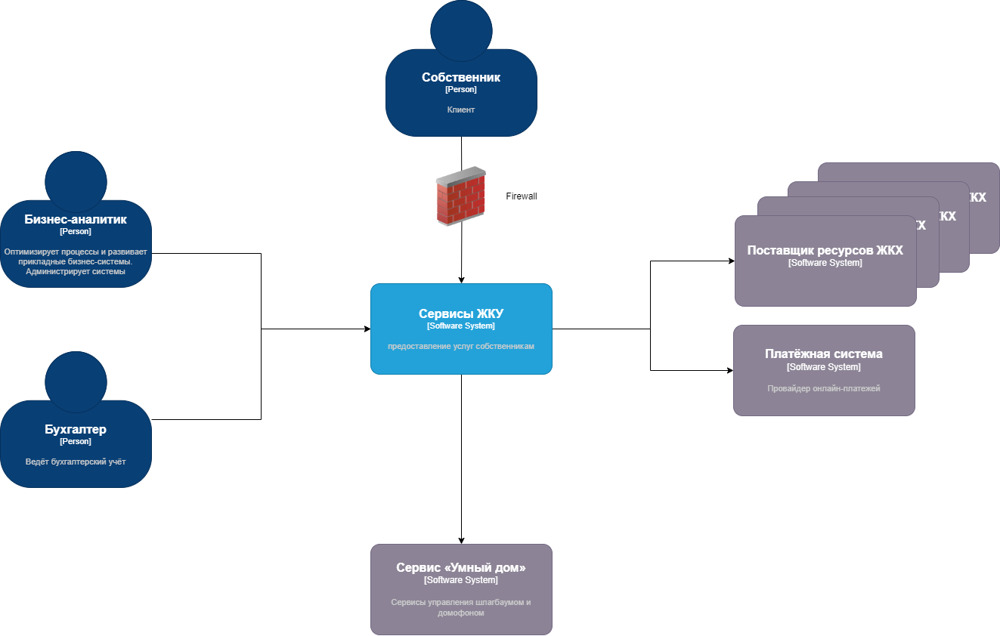
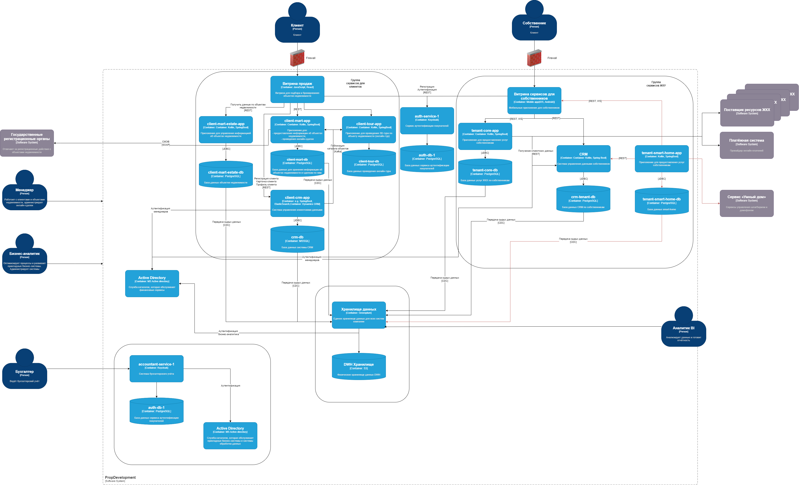

# Внешние интеграции

[Диаграмма контекста в формате drawio](Context_С4_model.drawio)

[Диаграмма контейнеров в формате drawio](PropDevelopment_С4_model.drawio)

# Cписок требований

## Требования к безопасности
- Использование токенов доступа в запросах
- Использование MFA для аутентификации пользователей
- Данные должны передаваться в зашифрованном виде с использованием протокола HTTPS
- Хранение и обработка данных остуществляется в соответствии с дейтсвующим законодательством (152-ФЗ)
- Использование принципа наименьших привилегий в доступе к ресурсам

## Протоколы аутентификации и авторизации
- Использование протокола OAuth 2.0 для доступа к API

## Взаимодействие между системами предприятия и внешней платформой
Приложение smart-house осуществляет регистрацию пользователя во внешнем сервисе без передачи персональных данных и хранит данные для взаимодействия.
Конфиденциальные данные (биометрические данные и номера автомобилей) храняться на стороне внешнего сервиса.
Внешняя система предоствляет API для управления шлагбаумами и домофонами (открытие, видеоконтент). 
Приложение взаимодействует в внешним сервисом отправляя ему запросы и получая результаты, которые направляются пользователю.
Приложение осуществляет управление доступом пользователей к разрешенным сервисам (замкам, шлагбаумам и т.д.) 
